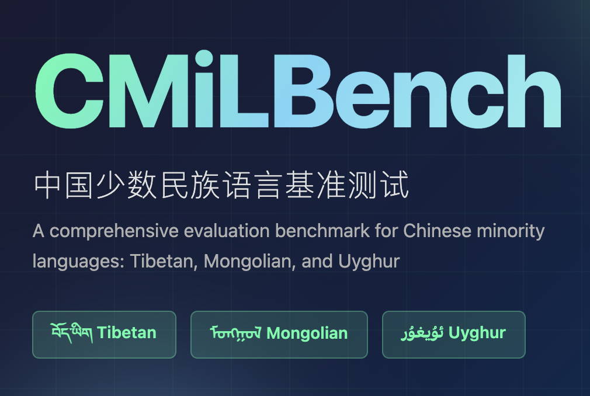

  
  

## Benchmark Introduction

**CMiLBench** is a hierarchical multitask evaluation benchmark specifically designed for Chinese ethnic minority languages (Tibetan `bo`, Mongolian `mn`, Uyghur `ug`). This benchmark aims to systematically evaluate large language models' understanding, generation, and safety alignment capabilities in low-resource language environments.

CMiLBench contains the following three major task categories with a total of 17 subtasks, covering linguistic foundational capabilities, cultural knowledge abilities, and multilingual safety:

- Foundation Tasks
- Chinese Minority Knowledge Tasks
- Safety Alignment Tasks

### Task Distribution Overview

---
